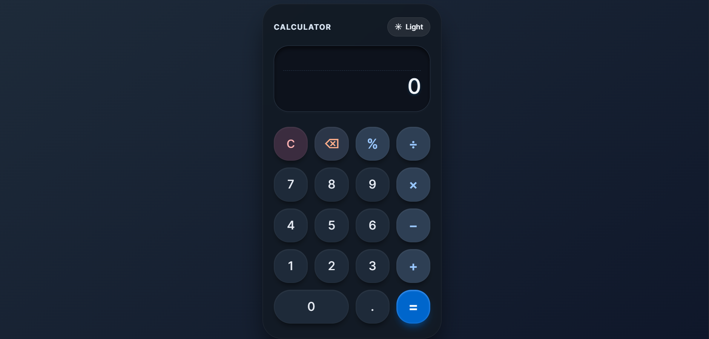
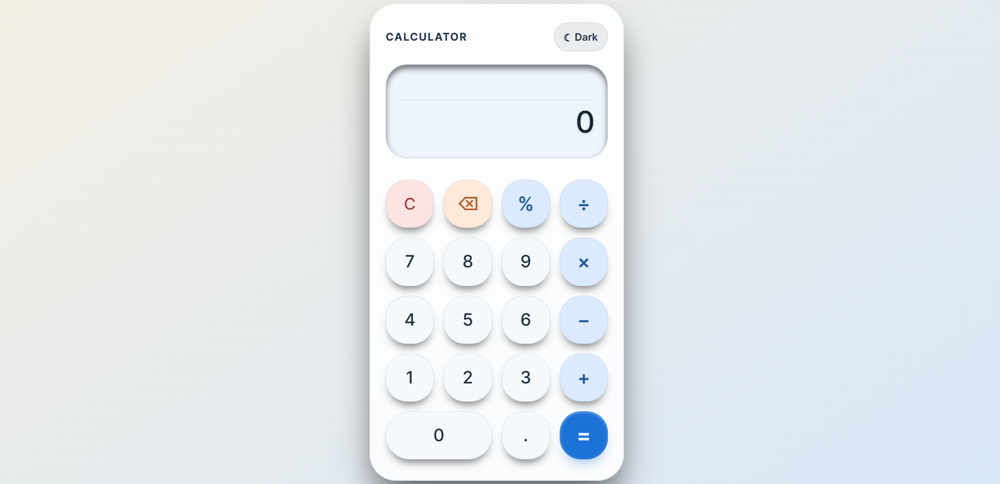

# Modern Calculator 🧮

A stylish and responsive calculator built with **HTML**, **CSS**, and **JavaScript**. It performs everyday calculations, supports keyboard input, and includes a smooth **light mode / dark mode** switch for a better user experience.

## ✨ Features

- 🔢 Perform basic arithmetic operations: addition, subtraction, multiplication, and division
- 📊 Calculate percentages quickly
- ⌫ Delete the last entered character
- 🧹 Clear the full calculation in one click
- ⌨️ Use both mouse and keyboard input
- 🌙 Toggle between dark mode and light mode
- 💾 Save the selected theme using local storage
- 📱 Enjoy a responsive layout that works on desktop and mobile

## 🛠️ Technologies Used

- **HTML5**
  Builds the structure of the calculator interface
- **CSS3**
  Styles the calculator, adds layout, colors, spacing, and theme design
- **JavaScript (Vanilla JS)**
  Handles calculator logic, button clicks, keyboard support, display updates, and theme switching
- **Local Storage**
  Remembers the user's selected theme even after refreshing the page

## ⚙️ Functions Of This Project

- **Display input and results**
  Shows the current number and the previous operation clearly on the calculator screen
- **Process arithmetic operations**
  Allows users to add, subtract, multiply, and divide numbers
- **Handle decimal values**
  Prevents invalid decimal input and keeps number formatting neat
- **Support percentage calculations**
  Converts values into percentages and supports percent-based calculations
- **Provide editing controls**
  Includes clear and delete actions for easier correction
- **Support keyboard shortcuts**
  Lets users type numbers and operators directly from the keyboard
- **Switch between themes**
  Lets users change the calculator between light and dark mode instantly
- **Improve accessibility**
  Uses labels and live regions to make interactions easier for more users

## 📁 Project Structure

- `index.html` - Main calculator layout
- `style.css` - Visual design, responsive styling, and theme colors
- `script.js` - Calculator behavior and theme logic
- `README.md` - Project documentation

## 🚀 How To Run

1. Download or clone the project.
2. Open `index.html` in your browser.
3. Start calculating.

## 🎯 Why This Project Is Useful

This project is a great beginner-friendly example of how to combine structure, design, and interactivity in a small web application. It demonstrates DOM manipulation, event handling, responsive UI design, and theme persistence in a simple and practical way.

## 👨‍💻 Author

Created as a modern calculator web project using frontend web technologies.
